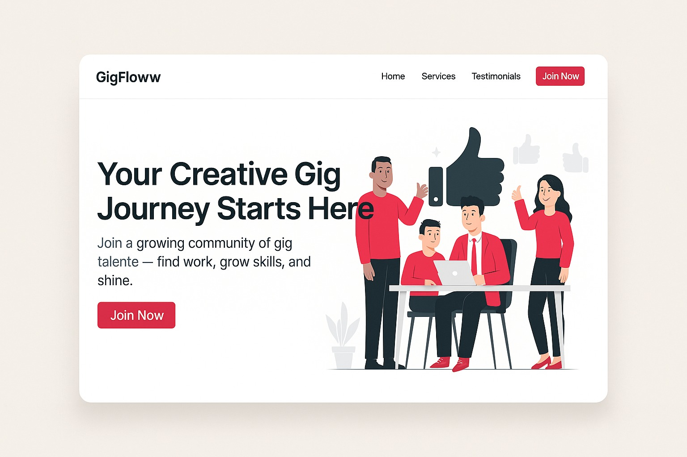

### GigFloww

A modern platform connecting talented freelancers with quality clients, built with Next.js, Tailwind CSS, and shadcn/ui.


## Overview

GigFloww is a comprehensive platform designed to empower creative professionals in the gig economy. The platform facilitates connections between freelancers and clients, provides skill development resources, and offers tools for portfolio showcasing and career growth.

## UI MOCK UP



## Features

- **Responsive Design**: Fully responsive UI that works seamlessly across mobile, tablet, and desktop devices
- **Interactive Navigation**: Dropdown menus and mobile-friendly hamburger navigation
- **Testimonial Slider**: Auto-rotating testimonials with manual navigation controls
- **Sign-Up Form**: Comprehensive registration form with validation
- **Modern UI Components**: Leveraging shadcn/ui for a clean, consistent design language
- **Optimized Images**: Next.js Image component for optimal loading performance


## Technology Stack

### Next.js

This project is built with Next.js, offering numerous benefits:

- **Server Components**: Utilizing React Server Components for improved performance and reduced client-side JavaScript
- **App Router**: Modern file-based routing system with nested layouts
- **Optimized Images**: Automatic image optimization with the Next.js Image component
- **Fast Refresh**: Instant feedback during development
- **SEO Friendly**: Built-in head management for improved search engine optimization
- **TypeScript Support**: Full TypeScript integration for type safety


### Additional Technologies

- **Tailwind CSS**: Utility-first CSS framework for rapid UI development
- **shadcn/ui**: High-quality, accessible UI components built with Radix UI and Tailwind
- **Lucide Icons**: Beautiful, consistent icon set


## Project Structure

```plaintext
gigfloww/
├── app/
│   ├── layout.tsx       # Root layout with metadata
│   └── page.tsx         # Homepage with all sections
├── components/
│   ├── footer.tsx       # Site footer with links and copyright
│   ├── navigation.tsx   # Responsive navigation bar
│   ├── testimonial-slider.tsx  # Interactive testimonial carousel
│   └── ui/              # shadcn UI components
├── public/              # Static assets
└── tailwind.config.ts   # Tailwind configuration
```

## Getting Started

### Prerequisites

- Node.js 18.17 or later
- npm or yarn


### Installation

1. Clone the repository:

```shellscript
git clone https://github.com/yourusername/gigfloww.git
cd gigfloww
```


2. Install dependencies:

```shellscript
npm install
# or
yarn install
```


3. Run the development server:

```shellscript
npm run dev
# or
yarn dev
```


4. Open [Link to The Deployed App](https://gig-floww-assigment-app.vercel.app/) in your browser to see the result.


## Why Next.js for GigFloww?

Next.js provides several advantages that make it ideal for the GigFloww platform:

1. **Performance**: Server Components and automatic code splitting ensure fast page loads
2. **SEO**: Server-side rendering improves search engine visibility, crucial for a freelancer platform
3. **Developer Experience**: Fast refresh and intuitive file-based routing accelerate development
4. **Scalability**: Built on React with optimizations for large applications
5. **Image Optimization**: Automatic image optimization reduces bandwidth and improves Core Web Vitals
6. **TypeScript Integration**: Type safety reduces bugs and improves code quality


## Deployment

The application can be easily deployed to Vercel with zero configuration:

```shellscript
npm run build
# or
vercel deploy
```
